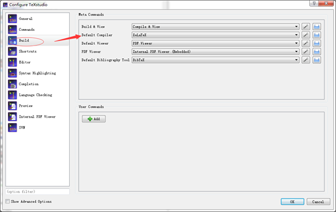

## latex

### 需要做的
在vs code中引入对latex的支持
https://www.jianshu.com/p/538856b3e5c0

### 之前做的
1）	下载TexStudio
http://texstudio.sourceforge.net/
2）	安装TexStudio
一路安装就可以了，咩什么好说的。
3）	下载MikTex
http://www.miktex.org/download
4）	安装MikTex
一路安装即可。
注意：MiKTex\tex\latex中放的是用到的包
5）	更新TexStudio的保存和预览方式，方便和pdf结合
Option => configure 。。。 => build => default compiler => XeLatex


``` latex
%-*- coding: UTF-8 -*-
% gougu.tex
% 勾股定理
\documentclass[UTF8]{ctexart}
\usepackage{graphicx}
\usepackage{float}
\usepackage{amsmath}
\usepackage{geometry}
\geometry{a6paper,centering,scale=0.8}
\usepackage[format=hang,font=small,textfont=it]{caption}
\usepackage[nottoc]{tocbibind}

\newenvironment{myquote}
{\begin{quote}\kaishu\zihao{-5}}
{\end{quote}}

\newcommand\degree{^\circ}

\title{\heiti 杂谈勾股定理}
\author{\kaishu 纸山}
\date{\today}

\bibliographystyle{plain}

\newtheorem{thm}{定理}

\begin{document}
    
    \maketitle
    \begin{abstract}
        这是一篇关于勾股定理的小短文。
    \end{abstract}
    \tableofcontents
    \section{勾股定理在古代}\label{sec:diyijie}
    西方称勾股定理为毕达哥拉斯定理，将勾股定理的发现归功于公元前 6 世纪的
    毕达哥拉斯学派 \cite{Kline}。该学派得到了一个法则，可以求出可排成直角
    三角形三边的三元数组。毕达哥拉斯学派没有书面著作，该定理的严格表述和证
    明则见于欧几里德\footnote{欧几里得，约公元前 330--275 年。}《几何原本》
    的命题 47：“直角三角形斜边上的正方形等于两直角边上的两个正方形之和。 ” 
    证明是用面积做的。
    
    我国《周髀算经》载商高（约公元前 12 世纪）答周公问：
    \begin{myquote}
        勾广三，股修四，径隅五。
    \end{myquote}
    又载陈子（约公元前 7--6 世纪）答荣方问：
    \begin{myquote}
        若求邪至日者，以日下为勾，日高为股，勾股各自乘，并而开方除之，得邪至日。
    \end{myquote}
    都较古希腊更早。后者已经明确道出勾股定理的一般形式。图\ref{fig:xiantu}是
    我国古代对勾股定理的一种证明 \cite{quanjing}。
    \begin{figure}[ht]
        \centering
     %   \includegraphics[scale=0.2]{xiantu.png}
        \caption{宋赵爽在《周髀算经》注中作的弦图（仿制），该图给出了勾股定理一个极具对称美的证明。 }
        \label{fig:xiantu}
    \end{figure}
    \section{勾股定理的近代形式}
    勾股定理可以用现代语言表述如下：
    \begin{thm}[勾股定理]
        直角三角形斜边的平方等于两腰的平方和。
    \end{thm}

    可以用符号语言表述为：设直角三角形$ABC$，其中$\angle C = 90\degree$，则有
    \begin{equation}\label{eq:gougu}
    AB^2 = BC^2 + AC^2.
    \end{equation}
    满足式\eqref{eq:gougu}的整数称为\emph{勾股数}。第\ref{sec:diyijie}节所说
    毕达哥拉斯学派得到的三元数组就是勾股数。下表列出一些较小的勾股数：
    \begin{table}[H]
        \begin{tabular}{|rrr|}
            \hline
            直角边 $a$ & 直角边 $b$ & 斜边 $c$ \\
            \hline
            3 & 4 & 5 \\
            5 & 12 & 13 \\
            \hline
        \end{tabular}%
        \qquad
        ($a^2 + b^2 = c^2$)
    \end{table}
    \nocite{Shiye}
    \bibliography{math}
\end{document}
```
