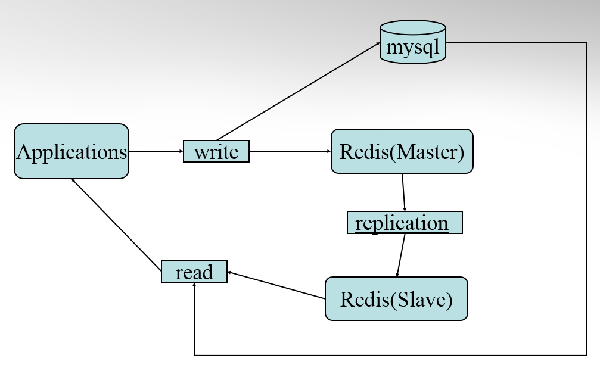

## 结绳记事-redis
ppt存在: /workplace/studio/pages/learning materials/redis/redis学习PPT
### 目录
Redis简介
Redis安装
Redis配置
Redis支持的数据类型
Redis的功能
持久化    （ persistence ）
主从复制（ master-slave replication ）
事物支持（ transaction ）
发布订阅（ pub/sub ）
管道        （ pipeline ）
虚拟内存（ vm ）
Redis性能
Redis部署
Redis应用场景
Java 使用 Redis
Redis总结

### 简介
* Redis是一款开源的、高性能的键-值存储（key-value store）。它常被称作是一款数据结构服务器（data structure server）。
* Redis的键值可以包括字符串（strings）类型，同时它还包括哈希（hashes）、列表（lists）、集合（sets）和 有序集合（sorted sets）等数据类型。 对于这些数据类型，你可以执行原子操作。例如：对字符串进行附加操作（append）；递增哈希中的值；向列表中增加元素；       为了获得优异的性能，Redis采用了内存中（in-memory）数据集（dataset）的方式。同时，Redis支持数据的持久化，你可以每隔一段时间将数据集转存到磁盘上（snapshot。 
* Redis同样支持主从复制（master-slave replication），并且具有非常快速的非阻塞首次同步（ non-blocking first synchronization）、网络断开自动重连等功能
* 同时Redis还具有其它一些特性，其中包括简单的事物支持、发布订阅 （ pub/sub）、管道（pipeline）和虚拟内存（vm）等 。
* Redis性能极高 – Redis能读的速度是110000次/s,写的速度是81000次/s 。
* Redis具有丰富的客户端，支持现阶段流行的大多数编程语言。 Java 使用 Redis,用到jedis.jar包。


### 安装
* Redis同样支持主从复制（master-slave replication），并且具有非常快速的非阻塞首次同步（ non-blocking first synchronization）、网络断开自动重连等功能
* 同时Redis还具有其它一些特性，其中包括简单的事物支持、发布订阅 （ pub/sub）、管道（pipeline）和虚拟内存（vm）等 。
* Redis性能极高 – Redis能读的速度是110000次/s,写的速度是81000次/s 。
* Redis具有丰富的客户端，支持现阶段流行的大多数编程语言。 Java 使用 Redis,用到jedis.jar包。

### 配置
* Redis默认不是以守护进程的方式运行，可以通过该配置项修改，使用yes启用守护进程
  daemonize no
* 当Redis以守护进程方式运行时，Redis默认会把pid写入/var/run/redis.pid文件，可以通过pidfile指定
    pidfile /var/run/redis.pid
* 指定Redis监听端口，默认端口为6379。
    port 6379
* 绑定的主机地址
    bind 127.0.0.1
* 当客户端闲置多长时间后关闭连接，如果指定为0，表示关闭该功能
    timeout 300
* 指定日志记录级别，Redis总共支持四个级别：debug、verbose、notice、warning，默认为verbose （详细信息）
    loglevel verbose

### redis支持的数据类型
Keys 
非二进制安全的字符类型（ not binary-safe strings ）
Values
Strings         （Binary-safe strings ）
Lists              （Lists of binary-safe strings ）
Sets              （Sets of binary-safe strings）
Sorted sets （Sorted sets of binary-safe strings ）
Hash

```
# key
redis本质上一个key-value 数据库，所以我们首先来看看他的key.首先key也是字符串类型，由于key不是binary safe的字符串，所以像“my key”和“mykey\n”这样包含空格和换行的key是不允许的。
我们在使用的时候可以自己定义一个Key的格式。例如 object-type:id:field 
Key不要太长。占内存，查询慢。
Key不要太短。u:1000:pwd   不如   user:1000:password  可读性好
```
```
# string
string是redis最基本的类型，而且string类型是二进制安全的。
redis的string可以包含任何数据。包括jpg图片或者序列化的对象。
最大上限是1G字节。 
如果只用string类型，redis就可以被看作加上持久化特性的memcached 
```

### 持久化
redis是一个支持持久化的内存数据库，也就是说redis需要经常将内存中的数据同步到磁盘来保证持久化，这是相对memcache来说的一个大的优势。redis支持两种持久化方式，一种是 Snapshotting（快照）也是默认方式，另一种是Append-only file（缩写aof）的方式。 
* Snapshotting  快照是默认的持久化方式。这种方式将内存中数据以快照的方式写入到二进制文件中,默认的文件名为dump.rdb。可以配置自动做快照持久 化的方式。我们可以配置redis在n秒内如果超过m个key被修改就自动做快照，下面是默认的快照保存配置
save 900 1  #900秒内如果超过1个key被修改，则发起快照保存save 300 10 #300秒内容如超过10个key被修改，则发起快照保存
save 60 10000
* Append-only file aof 比快照方式有更好的持久化性，是由于在使用aof持久化方式时,redis会将每一个收到的写命令都通过write函数追加到文件中(默认是 appendonly.aof)。当redis重启时会通过重新执行文件中保存的写命令来在内存中重建整个数据库的内容。当然由于os会在内核中缓存 write做的修改，所以可能不是立即写到磁盘上。这样aof方式的持久化也还是有可能会丢失部分修改。不过我们可以通过配置文件告诉redis我们想要 通过fsync函数强制os写入到磁盘的时机。
有三种方式如下（默认是：每秒fsync一次）
appendonly yes              //启用aof持久化方式
appendfsync always      //每次收到写命令就立即强制写入磁盘，最慢的，但是保证完全的持久化，不推荐使用
appendfsync everysec     //每秒钟强制写入磁盘一次，在性能和持久化方面做了很好的折中，推荐
appendfsync no    //完全依赖os，性能最好,持久化没保证

### 主从复制
主从复制允许多个slave server拥有和master server相同的数据库副本。下面是关于redis主从复制的一些特点
1.master可以有多个slave
2.除了多个slave连到相同的master外，slave也可以连接其他slave形成图状结构
3.主从复制不会阻塞master。也就是说当一个或多个slave与master进行初次同步数据时，master可以继续处理client发来的请求。相反slave在初次同步数据时则会阻塞，不能处理client的请求。
4.主从复制可以用来提高系统的可伸缩性（我们可以用多个slave 专门用于client的读请求，比如sort操作可以使用slave来处理），也可以用来做简单的数据冗余。
5.可以在master禁用数据持久化，只需要注释掉master 配置文件中的所有save配置，然后只在slave上配置数据持久化。

### 事务
redis对事务的支持目前还比较简单。redis只能保证一个client发起的事务中的命令可以连续的执行，而中间不会插入其他client的命令。 
Multi          事物开始
Exec          执行事务
Discard     放弃事物
Watch       监听key
Unwatch   放弃所有key的监听
watch 命令会监视给定的key,当exec时候如果监视的key从调用watch后发生过变化，则整个事务会失败。注意watch的key是对整个连接有效的，和事务一样，如果连接断开，监视和事务都会被自动清除。 

### 发布订阅
发布订阅(pub/sub)是一种消息通信模式。订阅者可以通过subscribe和psubscribe命令向redis server订阅自己感兴趣的消息类型，redis将消息类型称为通道(channel)。当发布者通过publish命令向redis server发送特定类型的消息时。订阅该消息类型的全部client都会收到此消息。这里消息的传递是多对多的。一个client可以订阅多个 channel,也可以向多个channel发送消息。
Subscribe
Unsubscribe
Psubscribe
Punsubscribe
Publish

### 管道
redis是一个cs模式的tcp server，使用和http类似的请求响应协议。一个client可以通过一个socket连接发起多个请求命令。每个请求命令发出后client通常 会阻塞并等待redis服务处理，redis处理完后请求命令后会将结果通过响应报文返回给client。基本的通信过程如下
	Client: INCR X
    Server: 1
    Client: INCR X
    Server: 2
    Client: INCR X
    Server: 3
    Client: INCR X
    Server: 4
基本上四个命令需要8个tcp报文才能完成。由于通信会有网络延迟,假如从client和server之间的包传输时间需要0.125秒。那么上面的四个命令8个报文至少会需要1秒才能完成。
利用pipeline的方式从client打包多条命令一起发出，不需要等待单条命令的响应返回，而redis服务端会处理完多条命令后会将多条命令的处理结果打包到一起返回给客户端。通信过程如下
Client: INCR X
Client: INCR X
Client: INCR X
Client: INCR X
Server: 1
Server: 2
Server: 3
Server: 4

### 虚拟内存
redis没有使用os提供的虚拟内存机制而是自己实现了自己的虚拟内存机制 ，但是思路和目的都是相同的。就是暂时把不经常访问的数据从内存交换到磁盘中，从而腾出内存空间用于其他需要访问的数据。尤其是对于redis这样的内存数据库，内存总是不够用的。除了可以将数据分割到多个redis server外。另外的能够提高数据库容量的办法就是使用vm把那些不经常访问的数据交换的磁盘上。如果我们的存储的数据总是有少部分数据被经常访问，大 部分数据很少被访问，对于网站来说确实总是只有少量用户经常活跃。当少量数据被经常访问时，使用vm不但能提高单台redis server数据库的容量，而且也不会对性能造成太多影响。
vm-enabled yes                          #开启vm功能
vm-swap-file /tmp/redis.swap         #交换的value保存的文件路径/tmp/redis.swap
vm-max-memory 1000000            #最大内存上限，超过后开始交换value到磁盘文件
vm-page-size 32                    #每个页面的大小32个字节
vm-pages 134217728                 #最多使用在文件中使用多少页面
vm-max-threads 4                    #用于执行value对象换入换出的工作线程数量，0表示不使用工作线程

### redis部署


### redis应用场景
1. Last Index
用户最近访问记录也是redis list的很好应用场景，lpush lpop自动过期老的登陆记录，对于开发来说还是非常友好的。
1. 排行榜应用，取TOP N操作
这个需求与上面需求的不同之处在于，前面操作以时间为权重，这个是以某个条件为权重，比如按顶的次数排序，这时候就需要我们的sorted set出马了，将你要排序的值设置成sorted set的score，将具体的数据设置成相应的value，每次只需要执行一条ZADD命令即可。
1. 计数器应用
Redis的命令都是原子性的，你可以轻松地利用INCR，DECR命令来构建计数器系统。
1. Uniq操作，获取某段时间所有数据排重值
这个使用Redis的set数据结构最合适了，只需要不断地将数据往set中扔就行了，set意为集合，所以会自动排重。
1. 实时系统，反垃圾系统
通过上面说到的set功能，你可以知道一个终端用户是否进行了某个操作，可以找到其操作的集合并进行分析统计对比等。没有做不到，只有想不到。
1. Pub/Sub构建实时消息系统
Redis的Pub/Sub系统可以构建实时的消息系统，比如很多用Pub/Sub构建的实时聊天系统的例子。
1. 构建队列系统
使用list可以构建队列系统，使用sorted set甚至可以构建有优先级的队列系统。
1. 缓存
这个不必说了，性能优于Memcached，数据结构更多样化。

### java调用redis
1、首先你需要下载驱动包，下载 jedis.jar。
 //连接本地的 Redis 服务
      Jedis jedis = new Jedis("localhost");
//设置 redis 字符串数据
      jedis.set("runoobkey", "Redis tutorial");
     // 获取存储的数据并输出
     System.out.println("Stored string in redis:: "+ jedis.get("runoobkey"));

### 总结
* Redis使用最佳方式是全部数据in-memory。 
* 当需要除key/value之外的更多数据类型支持时，使用Redis更合适。 
* 当存储的数据不能被剔除时，使用Redis更合适。（持久化）


